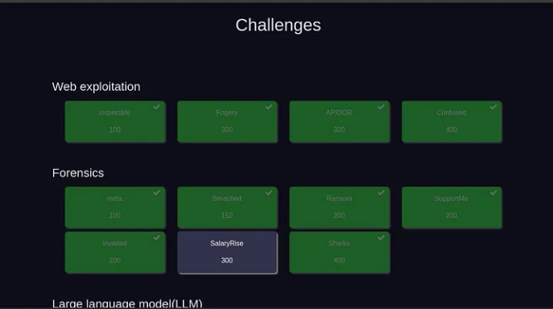
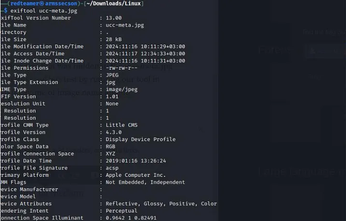
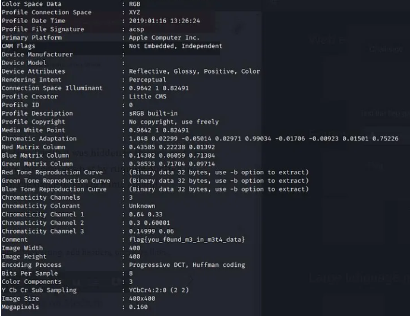
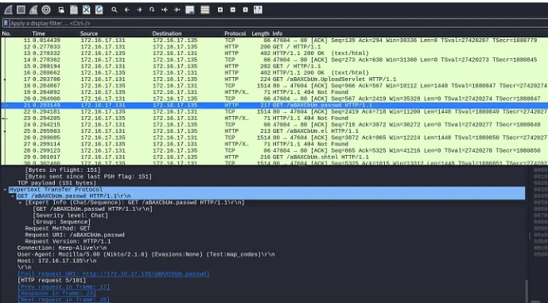
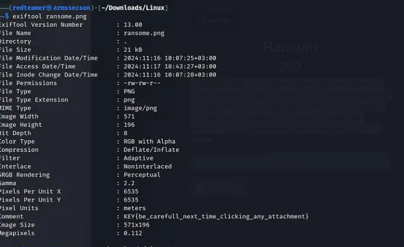
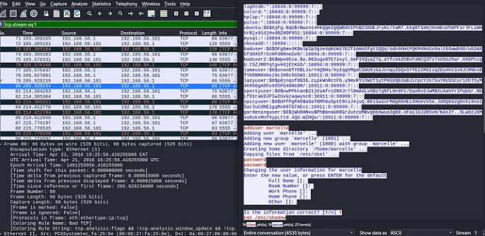
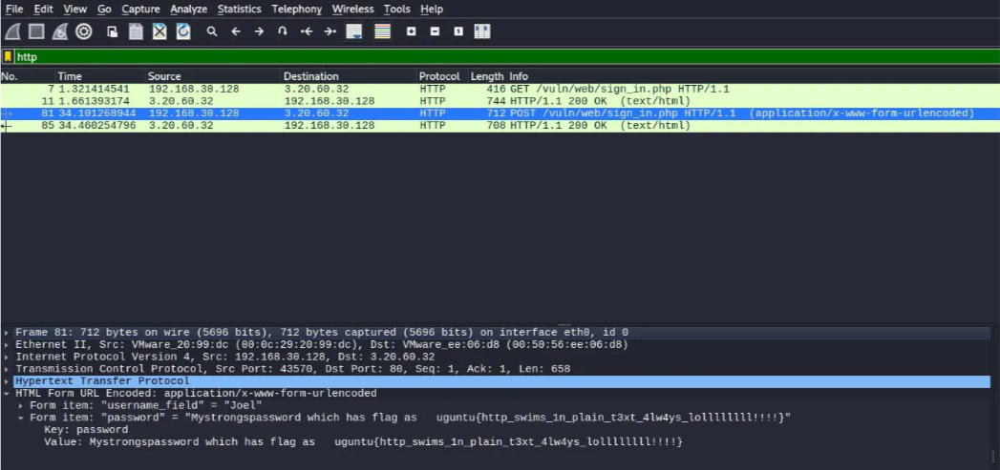
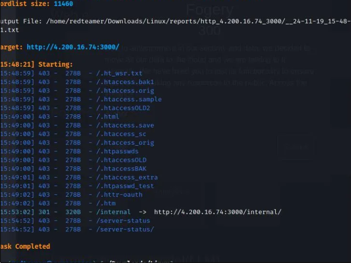
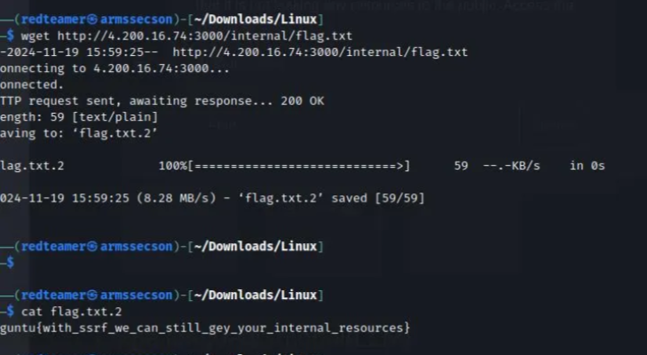

#        UCC_Cyber Drill Capture the flag 

During my journey to finish the UCC Cyber Drill ctf challenges that took place for two days on UCC , I had to hack several challenges that included Linux,web exploitation,forensics and many more, that were given to me and attain the flags hence getting points from each flag got right.

#  Forensics.

meta.

We have to find the information/flag that was hidden in the ucc-meta.jpg image that was given to us. In this case lets test by running our tool in terminal called exiftool with the name of image name at hand.

As we see in the second picture of our results on exiftool, the comment is the flag we were looking for in the image.

Flag : flag{you_f0und_m3_in_m3t4_data}

# Breached.

They’ve been trying to breach our infrastructure all morning! They’re trying to get more info on our covert sharks! We need your help, we’ve captured some traffic of them attacking us, can you tell us what tool they were using and its version?

flag format: uguntu{tool_version} eg uguntu{nmap_2.1}

When we have a look at the user-agent under the HTTP Protocal. We noticed that the tool used used is nikto version 2.1.6

flag : uguntu{Nikto_2.1.6}

And indeed this is the flag that was expected.

# Ransom

Your organization has fallen victim to a ransomware attack. Critical files have been encrypted, and the attackers have left a ransom note demanding payment. As part of the Ug_cert, you must work to respond to the attack, recover your systems, and prevent future incidents.flag format KEY{...}

In order for us to analyse and see the hiden information in this image we shall use exiftool tool syntax exiftool image_name

When we look at the comment from the results of our scan, the content of the comment is the flag we were looking for.

flag : KEY{be_carefull_next_time_clicking_any_attachment}

# SupportMe

A support stuff has received an attachment form the finance department seeking for support that the file seems to be hiding some data.The support stuff since he attended cyber security training a day before from the boardroom feared to open the file as it was highlighted in the training about attack surfaces,please help analyse the attachment

Flag starts with uguntu{}

flag:

# Invaded

Attackers have gained access in our active directory environment and they created a user for persistence. We captured the network traffic and you goal is to analyze the file and identify the user created and remove to contain the breach flag format UCC{user:password}

When we follow the TCP stream we get to see the details of the user created with all the details about that person as seen in the screenshot. We noticed that username is marcelle and the password is password

flag: UCC{marcelle:password}

# Sharks

Ug-Cert is responding to a public-facing website incident with a simple login page. The page allows users to enter their username and password to access their account. Unfortunately, due to misconfiguration, the login form is served over HTTP rather than HTTPS, meaning the credentials are sent in plaintext. find the flag in the process of anlysing this file.

Flag format: uguntu{}

We get few streams of HTTP that will save our time going through all the filters one by one. We identify an http stream with info of POST /vul/web/sign_in.php HTTP/1.1 ………. When we follow the stream we are able to see the flag. Or When we expand the HTML FORM URL Encoded: in the down section were we see different info about the selected stream in our analysis section. We see the username_field and form item having the flag we are looking for.

flag : uguntu{http_swims_1n_plain_t3xt_4lw4ys_lollllllll!!!!}

# Web exploitation.

InspectMe

We have developed our secure portal for accessing the company sensitive information. Can ypu check for us how secure it is! flag uguntu{} 

We login with the provided username and password. We access the insect the page by right clicking within you page browsed , navigate to network refresh the page and left click on documet returned and you will get access to webpage headers, payloads, response cookies etc. Under cookies we have the flag.

flag: flag{c00ki3s_4r3_fun}

# Fogery

Due to advancement in our security and data, we decided to move all our data to the cloud and we are talking to it internally. We have hired you to test its functionality to ensure that it is not leaking any resources to the public. Access the instance here

To be able to solve this challenge l started with a dirsearch , to search for all possible directories that the website have from which we may be able to get the flag by trying to visit different links we get from the dirsearch. We a tool called dirsearch with a flag -u

After getting different links towards the website. Now lets crawl the web pages to see if we get the flag

After obtaining the flag and we cat it we get the flag.

flag: uguntu{with_ssrf_we_can_still_gey_your_internal_resources}

#
With these few insights they can get you through the ctf and empower you into the exciting journey of capturing the flags.

